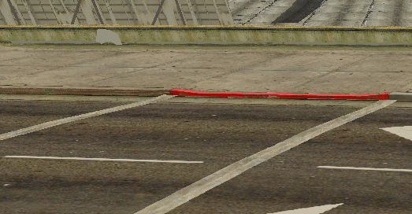

# Tweak Control 🐛
<b>TweakControl</b> is a library for @multitheftauto it consists of creating interactivity panels to control tests or debugs <br>

:warning: Still under in development




### How to Import
First of all, you need to import the library BEFORE your modules
```xml
<script src="path/to/myfolder/libs/tweakcontrol.lua" type="shared" />
```
Or use instanted the exports
```lua
exports.tweakcontrol()
```

### Debug Table
```lua
local tweak = exports.tweakcontrol:TweakControlClass("Flashii Debugger")

local myDebugTable = {
  MyText = "Flashii",
  ToggleLogo = true,
  RotateLogo = 0,
  myColor = "#fff",
  Wave = 0
}
```
The debug table is just a nice name, you can create custom tables or use a test pattern you can use a table of a system for example a car system where the value of the camber of the wheels will be stored, the options are infinite.

### Inputs
```lua
 local tweak = exports.tweakcontrol:TweakControlClass("Flashii Debugger")

local myDebugTable = {
  MyText = "Flashii",
  ToggleLogo = true,
  RotateLogo = 0,
  myColor = "#fff",
}

-- String Input-type
tweak:add("input", myDebugTable, 'MyText')

--- Boolean Input-Type
tweak:add("input", myDebugTable, 'ToggleLogo')

--  Slider Input-Type
tweak:add("input", myDebugTable, 'RotateLogo', {
  step = 1,
  min = 0,
  max = 360
});

--  Color Input-type
gui:add("input", myDebugTable, 'myColor')
```
These are the input methods so far, they are all different from each other, and when changed they all change your "DEBUG TABLE" remember, to use ``gui:add`` you need to have a base table.


### Monitors
```lua
local tweak = exports.tweakcontrol:TweakControlClass("Flashii Debugger")

local myDebugTable = {
  Wave = 0
}
  
tweak:add("monitor", myDebugTable, 'Wave', {
  view = 'graph',
  min = 1,
  max = 100,
})
```
This is a simple inline activity monitor, you can pass an FPS or an MS or any other value that keeps switching during rendering. (you can use gui:setMonitorValue() to change the value.)

<br>

Contribute or consider following me at:
| [](https://github.com/flashiie) |
| ----------------------------------------------------------------------------------------------- |
| [Vítor Ribeiro](https://github.com/flashiie)     
